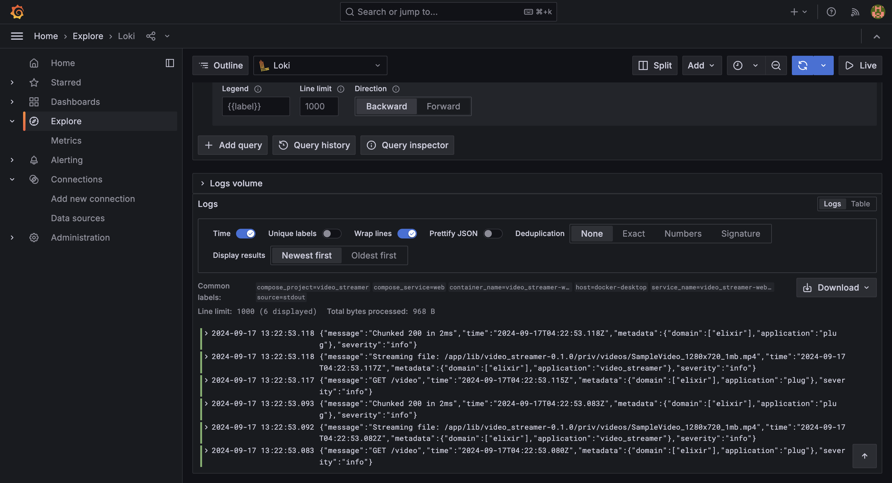

# Video Streamer

Implemented video streaming project described in [Bootstrapping Microservices](https://www.bootstrapping-microservices.com) using Elixir.

You need Docker and Docker Compose installed to run this.

Boot it up from the terminal using:

    docker plugin install grafana/loki-docker-driver:latest --alias loki --grant-all-permissions
    docker compose up

Open web browser and type `http://localhost:5454/video`.

Open new browser tab and type `http://localhost:3000`. You can view logs similar to the screenshot.

Clean up the project from the terminal using:

    docker compose down --rmi=all
    docker plugin disable loki

## Enable AWS S3

To use AWS S3, you need to create S3 bucket and upload video under `priv/videos/` folder.

Boot it up from the terminal using:

    export AWS_ACCESS_KEY_ID=your_access_key_id AWS_SECRET_ACCESS_KEY=your_secret_access_key \
        AWS_REGION=your_aws_region S3_BUCKET=your_s3_bucket
    docker compose -f docker-compose-prod.yml up
